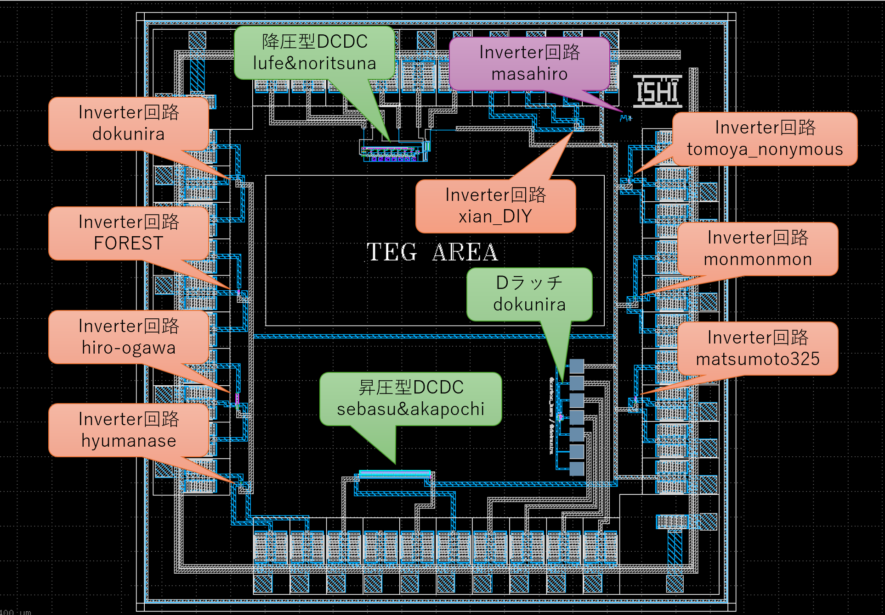
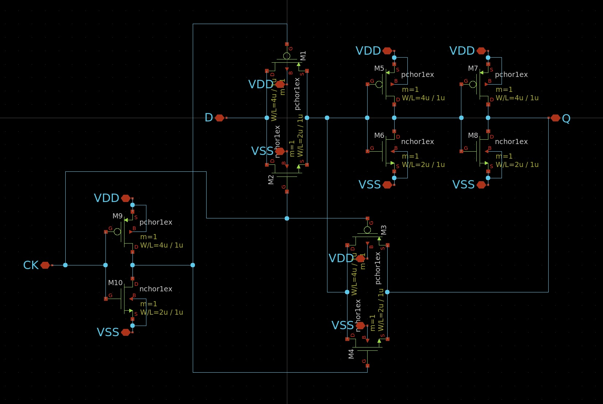
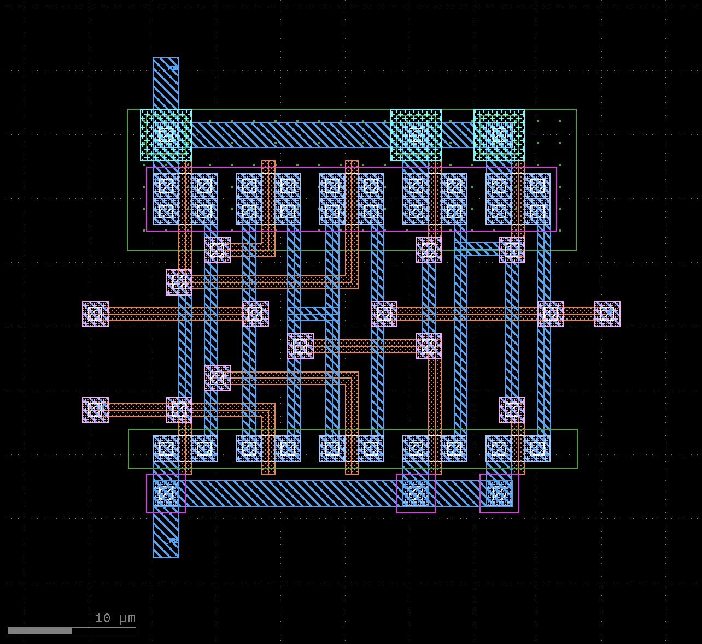
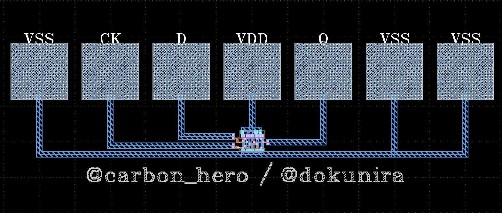
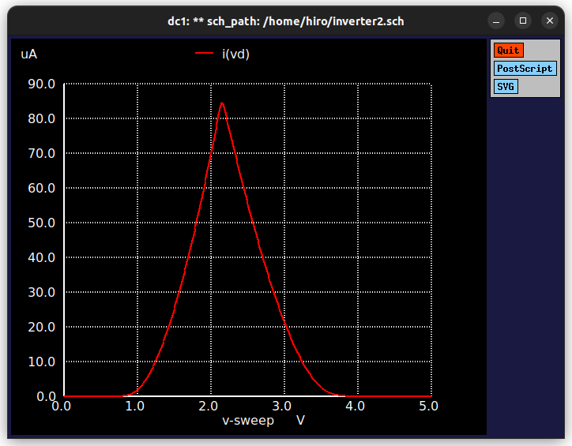
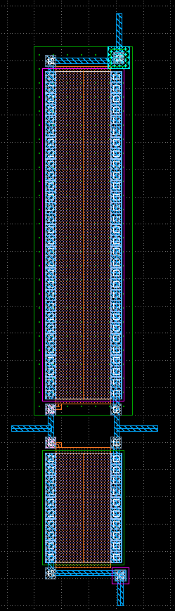
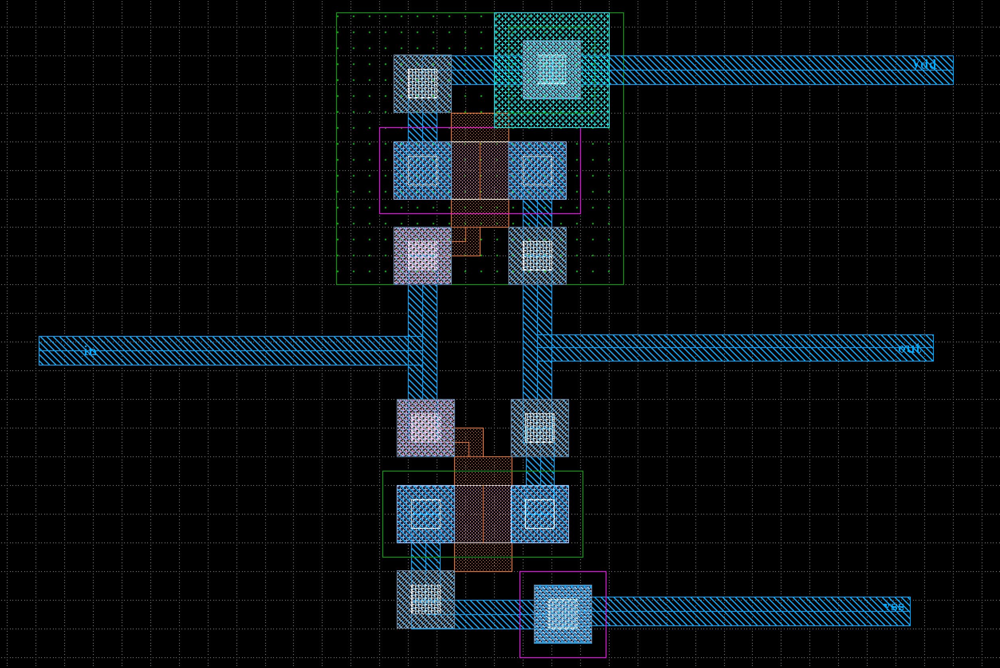
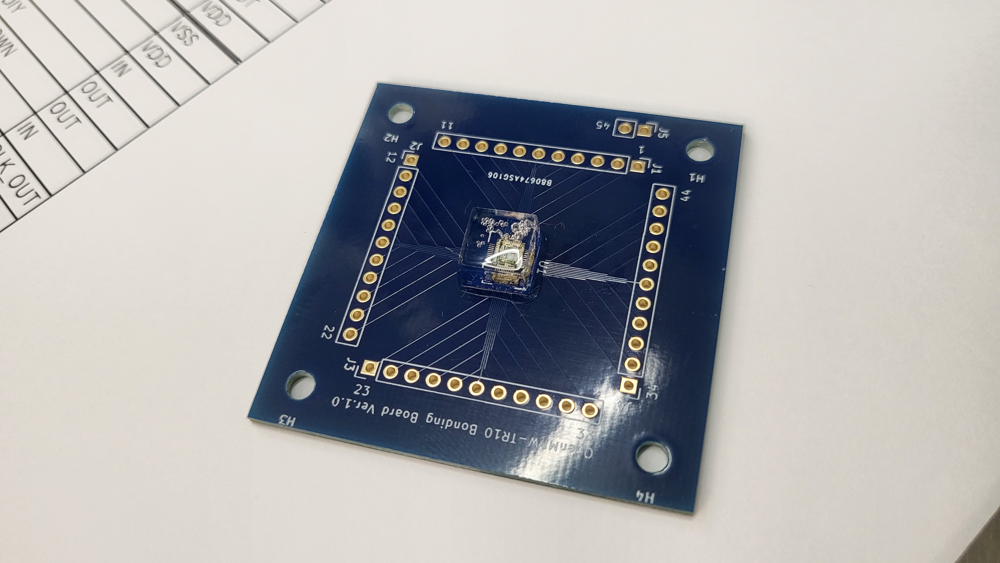

# ISHI会版OpenMPW TR10-1について
これは、[ISHI会版OpenMPW TR10-1](https://ishi-kai.org/openmpw/shuttle/tr10/2024/10/15/shuttle_ISHI-Kai_OpenMPW-TR10-1_start.html)にみんなで相乗りしたxschemによる回路図とklayoutによるレイアアウト置き場です。


## みんなの[相乗りチップ](Submitted/all_members_layout.gds)
- 
- 
- 

### 相乗りチップのラベル
- 緑枠  
-- DCDC回路  
- オレンジ枠  
-- 初めてのInverter回路  
- 紫枠  
-- 初めてのInverter回路だけどピン不足によりレイアアウト配置のみ  


# 参加者リスト
- [dokunira](https://github.com/dokunira/inverter_layout)
- [f0r3st](https://github.com/foorests/inverter_ISHI)
- [hiro-ogawa](https://github.com/hiro-ogawa/ishi-kai-OpenMPW-TR10-1)
- [hyumanase](https://github.com/hyumanase/inverter)
- [matsumoto325](https://github.com/matsumoto325/ISHI-Kai-commit/)
- [monmonmon](https://github.com/monmonmon/ishi-20241027)
- [tomoya_nonymous](https://github.com/tomoyanonymous/20241027_ishikai_inverter)
- [xian_DIY](https://github.com/ugeugeHigh/ISHI_xian_first)
- [masahiro](https://github.com/pochiMasahiro/inverter_masahiro)
- [lufe](https://github.com/1uf3/)
- [noritsuna](https://github.com/noritsuna/)
- [sebasu](https://github.com/sebasu-semi/)
- [akapochi](https://github.com/akahoshi0502/)


## 各種リスト
- [ピンリスト](docs/pin_list.pdf)


# 参加者のデザイン
## [dokunira](https://github.com/dokunira/inverter_layout)：Inverter回路
### MOSのパラメータ
| | ゲート幅 w (μm) | ゲート長 l (μm) |
|----|----|----|
|PMOS| 4 | 1 |
|NMOS| 2 | 1 |

### 感想
以前からオープンソースのレイアウトソフト「KLayout」で設計を行いたいと思っていましたが、なかなか取り組む機会がありませんでした。今回は教えていただきながら進めたことで、短時間で設計を完了することができました。Design Rules Check (DRC) や xschemとの連携による Layout Versus Schematic (LVS) などのレイアウト検証も行え、大変満足しています。ありがとうございました。

- 
- 

#### Dラッチ回路
[初めての半導体設計・製造体験 for ISHI会のOpenMPW](https://ishikai.connpass.com/event/332952/) でインバータのレイアウト設計をした後、枠がもし余っていたらと思って作ったDラッチのレイアウトです。  

- 
- 
- 


## [f0r3st](https://github.com/foorests/inverter_ISHI)：Inverter回路
### 感想
アナログ回路について、教科書で仕組みやいくつかの回路を読んだりはしていたのですが、具体的な実装方法が分からなかったので今回のイベントに参加しました。  
xschemやklayoutを使って実際に回路図やレイアウトパターンを作るのが楽しかったです。ありがとうございました！  

- 
- 


## [hiro-ogawa](https://github.com/hiro-ogawa/ishi-kai-OpenMPW-TR10-1)：Inverter回路
- 環境構築
  - [セットアップスクリプト](https://github.com/ishi-kai/OpenRule1umPDK_setupEDA)
  - セットアップスクリプトの中身を確認したら、環境構築をガリガリやっているので、怖くなって専用PCを用意して、OSをクリーンインストール
  - Ubuntu 22.04.5 をセットアップ

```bash
sudo apt update
sudo apt upgrade -y
sudo apt install -y git

git clone git@github.com:ishi-kai/OpenRule1umPDK_setupEDA.git

cd OpenRule1umPDK_setupEDA
bash ./eda-setup.sh
bash ./pdk_TR-setup.sh
```

- 使ったツール
  - xschem
  - ngspice
  - klayout

### 設計情報

- Pch FET
  - W: 60um
  - L: 10um
- Nch FET
  - W: 20um
  - L: 10um

### シミュレーション結果
- 
- 

### 感想
- とりあえず最後まで完走できた
- 事前にOSのクリーンインストールをしておいたので、セットアップで問題が発生することがなくて良かった
- 半導体が自分で作れるって夢が広がる
- まぁそう言っても、すごいチップが作れるわけではないだろうけど・・・
- アナログ回路がわからんといけないのかな
- ツールが全体的に使いにくいのが残念

- 
- 


## [hyumanase](https://github.com/hyumanase/inverter)：Inverter回路
### 感想
[2024年10月イベント：初めての半導体設計・製造体験 for ISHI会のOpenMPW - connpass](https://ishikai.connpass.com/event/332952/)にて、初めての半導体設計をしました。難しくもたのしい時間でした。マウスと、めげない心と、皆さんの支えでなんとかなりました。ありがとうございました！  

- 
- 


## [matsumoto325](https://github.com/matsumoto325/ISHI-Kai-commit/)：Inverter回路
### 感想

* 会場について

     GMO Yours・フクラスの図書室で実施。施設はとてもきれいでした。  
     結構前に渋谷駅に着いたのですが、道がだいぶ変わっていて場所がわからない。下見をするかネットで良く調べてから行けばよかった。  
     少し遅れて到着したのでConnpassのフィードで連絡したのですが返信なし。たまたま中の人を一人知っていたので個別に連絡とって中に入れました。その節はお手数をおかけいたしました。

* 講習について

     環境の構築はスクリプト2発で出来て、時間はかかりましたが簡単に準備ができました。  
     資料は記載された内容のままに操作すれば出来るような書き方にはなっていなくて手間取りましたが、それがかえって理解度の向上につながった気がします。  

* xschem について

     操作感は慣れるまで少しかかったけど、なかなか良かった。ライブラリも事前にある程度用意してくれたのでさくさく進められましたが、自分で作らなければならない局面とかあるのかな？と思ったりしてますが、まだ調べてないです。どこかで拾ってインポートする方法とかも聞いてみたいです。

* klayout について

     もっと自動的に配置してくれるのかと思ったら以外に手動でしたｗ  
     1bit メモリに値する回路でもこんなに苦労するんだったら、大型のチップを焼くのにはどのくらい労力がかかるのだろうと思うと、いつも大型の LSI を設計してくれてる人たちに感謝の気持ちが湧いてきました。
     他の人のレイアウトを覗き見したら面白いレイアウトがあって、それも楽しめました。


- 
- 


## [monmonmon](https://github.com/monmonmon/ishi-20241027)：Inverter回路
### 感想
お絵描きツールの使い方を覚えた！  

- 
- 


## [tomoya_nonymous](https://github.com/tomoyanonymous/20241027_ishikai_inverter)：Inverter回路
### 感想
（感想）ほぼ初心者状態からのスタートでしたが一応作れたようなのでよかったです！  

- 
- 


## [xian_DIY](https://github.com/ugeugeHigh/ISHI_xian_first)：Inverter回路
### 感想
色々教えて頂きありがとうございました！  
初めてのツールという事もあり、開発環境の構築で躓いてしまいました。  
UbuntuをいれたLets noteを持って会場にいったのですが、何故か何度もフリーズしてしまい…  
当日は完走できませんでしたが、翌日自宅のメイン環境で再度環境構築をしてトライしてみたところ、なんとか最後までいきつけました。  
製造枠がまだ空いているとのことで頑張ってみたのですが、果たして間に合うか！？  

- 
- 


## [masahiro](https://github.com/pochiMasahiro/inverter_masahiro)：Inverter回路
### 感想
FET2個の単純なインバータでもIC設計を体験することができてとても楽しかったです。資料も充実していて独学でも困りませんでした。次はもう少し複雑な回路を設計してみようと思います。  

- 
- 


## DCDC_DOWN_Converter_4_ISHI-KAI_OpenMPW_TR10-1
ISHI-KAI_Multiple_Projects_OpenMPW_TR10-1 向けの降圧型DCDCコンバータ（12v->5V）です。


### Members 
- [lufe](https://github.com/1uf3/vco)
    - VCO担当
- [noritsuna](https://github.com/noritsuna/DCDC_DOWN_Converter_4_ISHI-KAI_OpenMPW_TR10-1)
    - 降圧部担当


### 内容
- 
- 
- 

### vco
[lufe](https://github.com/1uf3/vco)担当

#### xschem

##### inverter


##### buffer


##### vco


##### simulated vco hz


#### klayout


### 降圧部
#### xschem
- 

##### simulation
- 
- 

#### klayout
- 


### 降圧型DCDCコンバータ
#### xschem
- 

##### simulation
- 
- 

#### klayout
- 


## [昇圧型DCDCコンバータ](member_project/BoostDCDC/)
ISHI-KAI_Multiple_Projects_OpenMPW_TR10-1 向けの降圧型DCDCコンバータ（5V->12v）です。

### Members 
- [sebasu](https://github.com/sebasu-semi/)
    - 昇圧部担当
- [akapochi](https://github.com/akahoshi0502/)
    - 変換担当

### [昇圧型DCDCコンバータ](member_project/BoostDCDC/)
#### xschem
- 

#### ngspice
- 

#### klayout
-  


# 測定会
## 製造されたチップ
到着したチップです。  

- 
- 


チップ写真です。  

- 


## ボンディング
パッケージの選択肢がないため、自分たちでボンディングすることにしました。  
そこで、ボンディング用の基板をKiCADで設計して、製造しました。

-  

- [Bonding Board](kicad/OpenMPW-TR10/) 

### ボンディング用のボード
ボンディング用のボードにベアダイを張り付けた状態です。  
今回はUVレジンで貼り付けました。本来ならペースト半田で取り付けるのが良いかと思います。  

- 
- 
- 


### ボンディング作業風景
ボンディング中の風景です。  
みんな、初めてのため苦戦しました。  

- 
- 
- 


### ボンディング完了
無事にボンディングが完了したチップたちです。  

- 
- 
- 


### ポッティング完了
ボンディングしたチップをUVレジンでポッティングしました。  
思ったよりもきれいにポッティングできたようです。  
透明なため特性としては最悪ですが、観察用には最適でした。  

- 
- 
- 
- 
- 
- 


### ボンディング測定
ボンディングしたチップを測定しました。  
動作点が4Vとなりました。ちょっと高いため、ハズレかけていて接触抵抗が高い線が紛れていそうです。  

- 
- 


## パッケージされたチップ
東海理化さんのご厚意により「パッケージした場合のサンプル」としてISHI会のチップをパッケージしていただけました！  

- 


## 測定会風景
測定用の装置やセットアップ中の風景です。  

- 
- 


### インバーター測定
1kHz, 500kHz, 1MHzでどうさせてみた図です。  
500kHzくらいで限界って感じですね。  
まともに高速で動かすようには設計指定なので当然の結果ではありますが。高速に動かすには、Wを広くしたり、バランスよくP-FET,N-FETのL,Wを合わせる必要があります。  

- 
- 
- 


### Dラッチ測定
無事に使用通りに動きとなりました。  

- 
