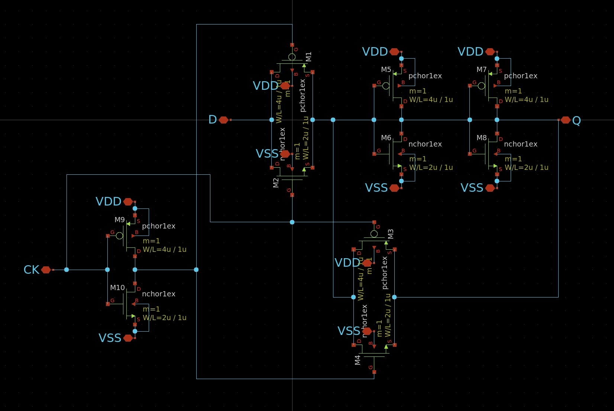
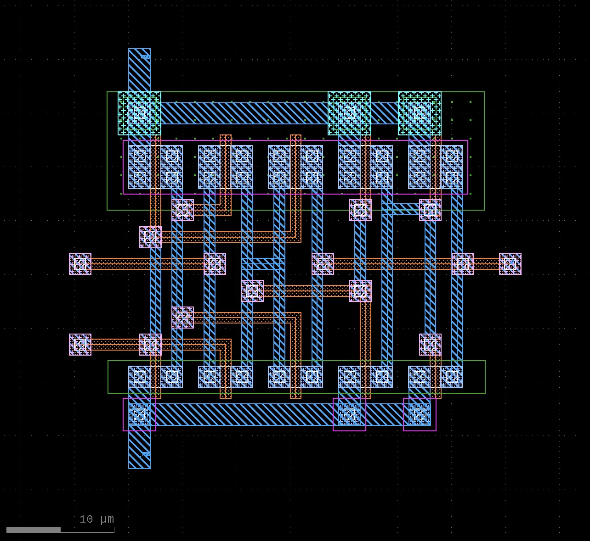
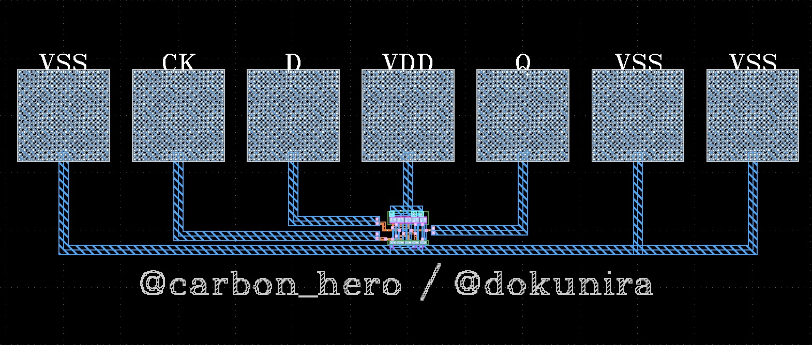

# D-latch layout
[初めての半導体設計・製造体験 for ISHI会のOpenMPW](https://ishikai.connpass.com/event/332952/) でインバータのレイアウト設計をした後、枠がもし余っていたらと思って作ったDラッチのレイアウトです。
connpass id : [carbon_hero](https://connpass.com/user/carbon_hero/)

