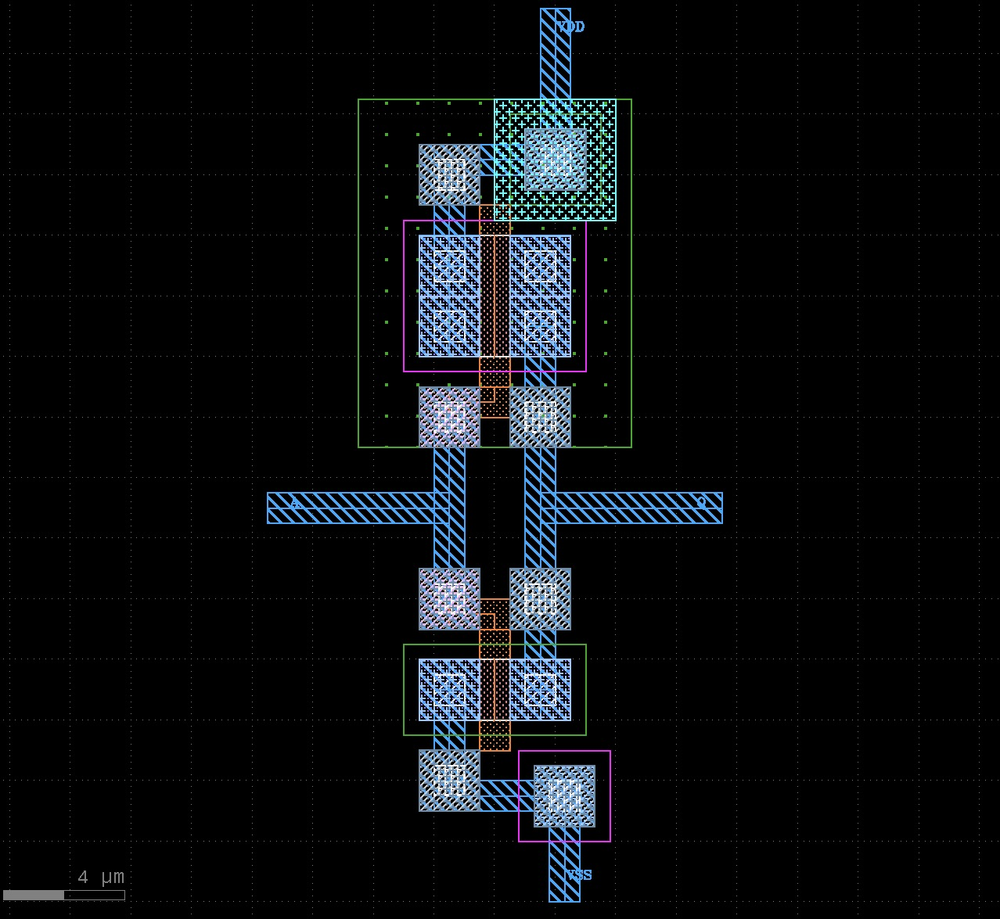

# インバータ レイアウト
[初めての半導体設計・製造体験 for ISHI会のOpenMPW](https://ishikai.connpass.com/event/332952/) で設計したインバータです。
connpass id : [carbon_hero](https://connpass.com/user/carbon_hero/)

## MOSのパラメータ
| | ゲート幅 w (μm) | ゲート長 l (μm) |
|----|----|----|
|PMOS| 4 | 1 |
|NMOS| 2 | 1 |

## 感想
以前からオープンソースのレイアウトソフト「KLayout」で設計を行いたいと思っていましたが、なかなか取り組む機会がありませんでした。今回は教えていただきながら進めたことで、短時間で設計を完了することができました。Design Rules Check (DRC) や xschemとの連携による Layout Versus Schematic (LVS) などのレイアウト検証も行え、大変満足しています。ありがとうございました。