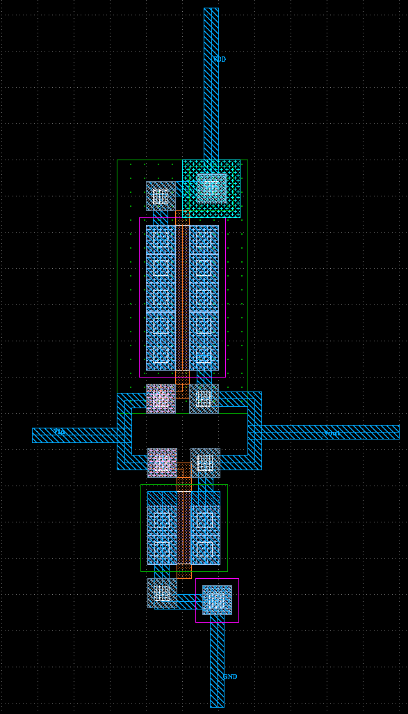
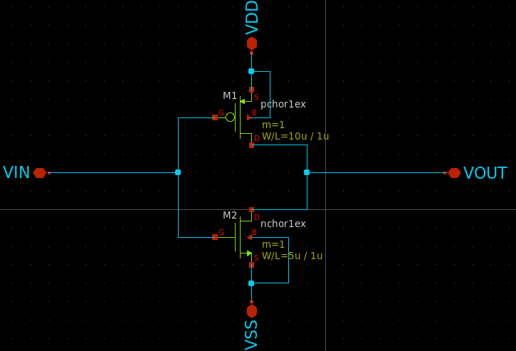

# 参加イベント
[初めての半導体設計・製造体験 for ISHI会のOpenMPW](https://ishikai.connpass.com/event/332952/)
# 感想
アナログ回路について、教科書で仕組みやいくつかの回路を読んだりはしていたのですが、具体的な実装方法が分からなかったので今回のイベントに参加しました。
xschemやklayoutを使って実際に回路図やレイアウトパターンを作るのが楽しかったです。ありがとうございました！

# レイアウト

# 回路図
