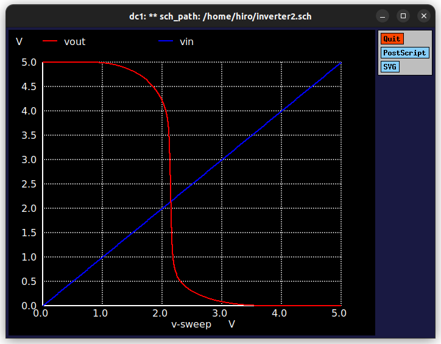
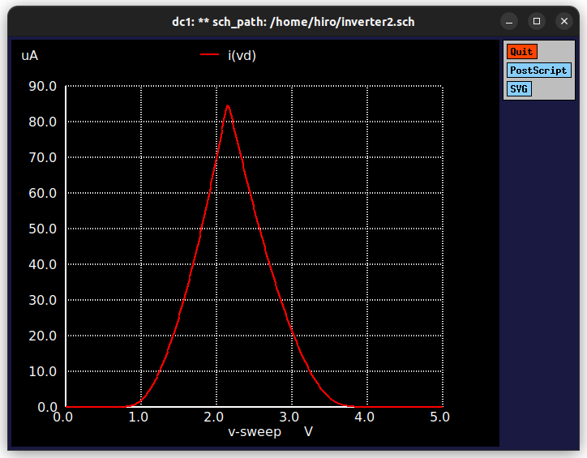
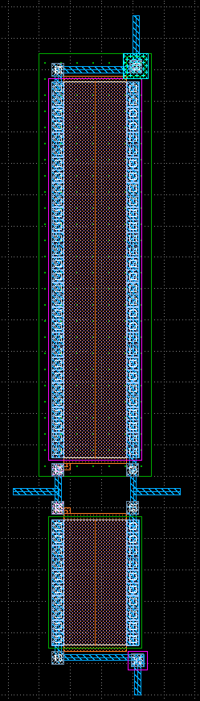

# 概要

[2024年10月イベント：初めての半導体設計・製造体験 for ISHI会のOpenMPW](https://ishikai.connpass.com/event/332952/) での成果物

## 具体的にやったこと

- 環境構築
  - [セットアップスクリプト](https://github.com/ishi-kai/OpenRule1umPDK_setupEDA)
  - セットアップスクリプトの中身を確認したら、環境構築をガリガリやっているので、怖くなって専用PCを用意して、OSをクリーンインストール
  - Ubuntu 22.04.5 をセットアップ

```bash
sudo apt update
sudo apt upgrade -y
sudo apt install -y git

git clone git@github.com:ishi-kai/OpenRule1umPDK_setupEDA.git

cd OpenRule1umPDK_setupEDA
bash ./eda-setup.sh
bash ./pdk_TR-setup.sh
```

- 使ったツール
  - xschem
  - ngspice
  - klayout

## 設計情報

- Pch FET
  - W: 60um
  - L: 10um
- Nch FET
  - W: 20um
  - L: 10um

## シミュレーション結果





## レイアウト



## 感想

- とりあえず最後まで完走できた
- 事前にOSのクリーンインストールをしておいたので、セットアップで問題が発生することがなくて良かった
- 半導体が自分で作れるって夢が広がる
- まぁそう言っても、すごいチップが作れるわけではないだろうけど・・・
- アナログ回路がわからんといけないのかな
- ツールが全体的に使いにくいのが残念
